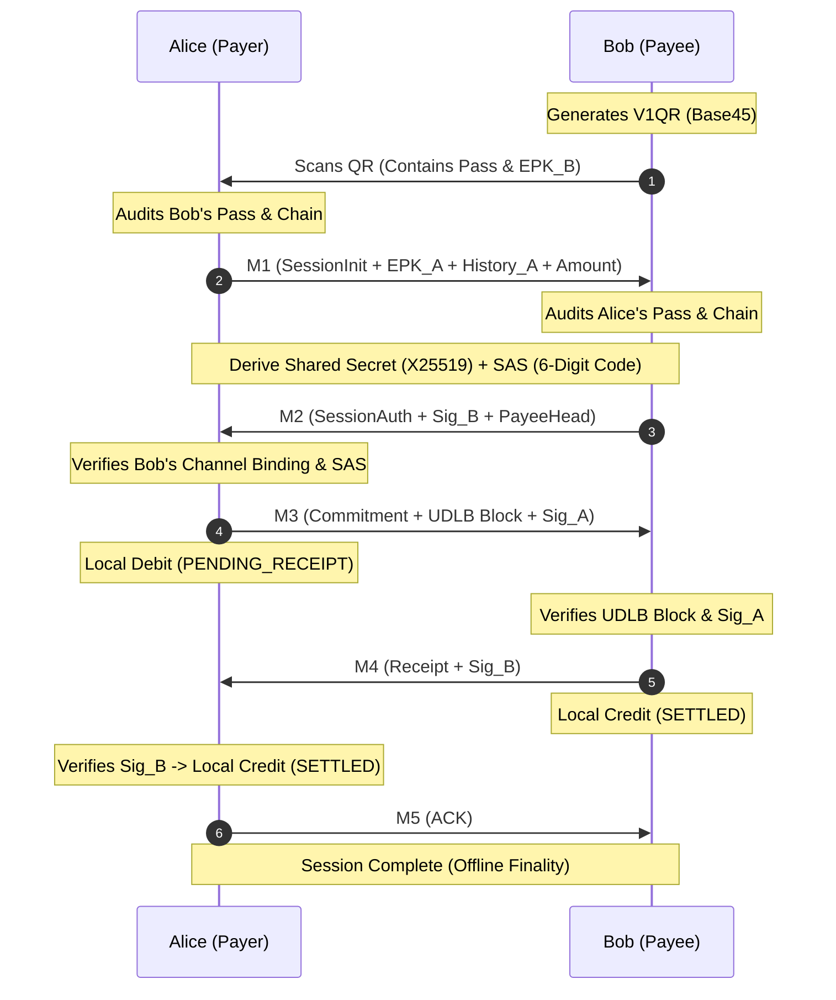

# 🛡️ Shadow Protocol v1 (OffWallet)

> **Zero-Trust, Non-Custodial, Hardware-Anchored Offline Payment Infrastructure for Android**

[](https://kotlinlang.org)
[](https://www.python.org)
[](https://fastapi.tiangolo.com)
[](https://firebase.google.com)
[](https://developer.android.com/training/articles/keystore)

---

## 🏆 Project Information

- **Hackathon**: HACK NEXUS 2026
- **Problem Statement ID**: PS-07 (Offline Micro-Payment Infrastructure)
- **Theme**: FinTech & Security
- **Team Name**: BobTheBuilder
- **Institution**: National Forensic Sciences University (NFSU)
- **Project Name**: ShadowPay / Shadow Protocol
- **Presentation**: [Download HackNeux2026_ShadowPay.pptx](docs/presentation/HackNeux2026_ShadowPay.pptx)

---

## 📌 Executive Summary

**OffWallet** implements **Shadow Protocol v1**, a state-of-the-art offline peer-to-peer (P2P) payment architecture that solves the fundamental challenge of digital transactions without internet access: **preventing double-spending and ledger divergence offline without relying on a central authority during the transaction.**

By combining **Android TEE/StrongBox hardware security**, **Unified Double-Linked Blocks (UDLB)**, and a **5-step BLE/QR Handshake (M1–M5)**, OffWallet enables instant, tamper-proof offline transfers with mathematical finality and non-custodial recovery.

---

## 🎬 Project Demonstration Videos

<details>
<summary><b>📹 Click to view embedded video demos from the presentation</b></summary>

### 1. Offline P2P Payment Handshake & Audit


### 2. BLE & QR Discovery Flow


### 3. Mutual Visual SAS (6-Digit Code) Verification


### 4. Background Sync & Dual-Head Recovery


</details>

---

## 📊 Comparison with Existing Systems

| Parameter | Our System (Shadow Protocol) | UPI Lite X (NPCI) | RBI Offline Framework | ElasticPay (IIT Indore) | Crunchfish Digital Cash |
| :--- | :--- | :--- | :--- | :--- | :--- |
| **Payment Type** | **P2P (Person-to-Person) + P2M** | P2P + P2M (NFC) | P2M (Cards/Wallets) | P2P | P2P + P2M |
| **Hardware Security** | **StrongBox/TEE (Keys never leave hardware)** | None (Software wallet) | None specified | TPM + TEE + SE | TEE-based wallets |
| **Offline Verification** | **Atomic Co-Signing (Both sign same block)** | Deferred via PoS | Deferred settlement | Immediate settlement | Deferred (IOUs) |
| **Double-Spend Protection** | **Hardware Monotonic Counter + UDLB** | Server reconciliation | Server reconciliation | Hardware-enforced | IOU reconciliation |
| **Fraud Detection** | **Real-time Local Audit (`walkBack`)** | Post-sync detection | Post-sync detection | Hardware-enforced | Post-sync detection |
| **Max Offline Limit** | **Configurable (Default ₹2,000)** | ₹2,000 balance | ₹500/txn, ₹2,000 total | Not specified | Not specified |
| **Infrastructure Needed** | **None (Two Android phones only)** | NFC phones + POS | Cards / POS | TPM / SE hardware | Payment Network |
| **Communication Channel** | **NFC Bootstrap + BLE Session Channel** | NFC only | Proximity mode | NFC + Hardware | Multiple |

---

## 🚀 Key Architectural Innovations

### 1. ⛓️ Unified Double-Linked Block (UDLB) Architecture
Unlike traditional blockchains where a block only references the sender's history, every UDLB block cryptographically binds **both the Payer's and Payee's ledger chains simultaneously**:
- Contains `prevHash` / `counter` (Payer) **and** `payeePrevHash` / `payeeCounter` (Payee).
- Both parties co-sign the exact same 15-field canonical block structure before funds move.
- Eliminates "History Divergent" alerts during consecutive offline transactions.

### 2. 🛡️ Hardware-Anchored Vault (TEE / StrongBox)
- **Non-Exportable Keys**: User identity keys (Ed25519) are generated directly inside the device's hardware chip (`AndroidKeyStore`).
- **Hardware Attestation & Play Integrity**: Ensures keys cannot be extracted, and rejects modded or rooted devices before issuing an offline **Security Pass**.

### 3. 🔄 Self-Healing & Dual-Head State Propagation
- When either party syncs with the backend, the server **atomically advances the ledger heads for BOTH participants**.
- Includes **Passive Linkage Repair** to automatically bridge missing history links if transactions arrive out of order.

### 4. 🔑 Non-Custodial Recovery (2-of-3 Shamir's Secret Sharing)
- Local SQLite database encryption key (AES-256) is sharded using **Shamir's Secret Sharing**:
  - **Shard 1**: User Cloud Backup (Google Drive)
  - **Shard 2**: Backend Server
  - **Shard 3**: Trusted Third Party
- Wallet recovery requires **2 out of 3 shards**, ensuring the server can **never** access user funds without consent.

---

## 🔀 Shadow Protocol Handshake (M1–M5)



---

## 📂 Project Structure

```
Hackathon_Nexus/
├── android/                         # Native Android Application
│   ├── app/src/main/java/com/offlinewallet/
│   │   ├── crypto/                  # Cryptographic Primitives & Handshake Logic
│   │   │   ├── HashChainManager.kt  # UDLB Ledger & Verification
│   │   │   ├── MicroPaymentHandshake.kt # M1-M5 Protocol Encoders/Decoders
│   │   │   ├── SecureKeyStore.kt    # Android Keystore & TEE Integration
│   │   │   ├── Shamir.kt            # 2-of-3 Secret Sharing
│   │   │   └── SimpleDatabase.kt    # Encrypted SQLite Storage
│   │   ├── payment/ble/             # GATT Server & Advertiser (BLE)
│   │   ├── ui/                      # Material 3 UI & Explorer
│   │   └── MainActivity.kt          # Wallet Dashboard & QR Generator
│   └── build.gradle.kts
│
├── crypto/
│   └── backend/                     # Python Async Backend
│       ├── README.md                # Backend API Reference & Schema
│       ├── src/
│       │   ├── main.py              # FastAPI Application & Endpoints
│       │   ├── reset_system.py      # Cleans Database for Demonstrations
│       │   ├── test_full_cycle.py   # E2E Lifecycle Test Suite
│       │   ├── test_stress_scenarios.py # Edge Case & Stress Testing
│       │   └── offlinepay_crypto/   # Core Crypto & Settlement Engine
│       │       ├── settlement.py    # Dual-Head Settlement Engine
│       │       └── canon.py         # Canonical Encoder
│       └── venv/
│
├── docs/                            # Architecture Diagrams, Presentation & Media
│   ├── media/                       # Video Demos & Presentation Media
│   └── presentation/                # HackNeux2026_ShadowPay.pptx
└── README.md
```

---

## 🛠️ Getting Started

### Prerequisites
- **Android Studio** Ladybug or newer.
- **Android Device** running API 31+ (Android 12+).
- **Python 3.10+** (for running the backend).

---

### 1. Running the Backend Server

```bash
# Navigate to the backend directory
cd crypto/backend

# Activate Virtual Environment (or create one)
source venv/bin/activate

# Install Dependencies (FastAPI, Firebase Admin, Cryptography, Uvicorn)
pip install fastapi uvicorn firebase-admin cryptography python-dotenv

# Reset Database to Clean State (Optional for demo)
ENV=development python3 src/reset_system.py

# Run the Development Server
uvicorn src.main:app --host 0.0.0.0 --port 8000 --reload
```

#### Run Automated Settlement Tests
```bash
# Run the full integration lifecycle test
ENV=development python3 src/test_full_cycle.py

# Run the edge-case & stress test suite
ENV=development python3 src/test_stress_scenarios.py
```

---

### 2. Building & Running the Android App

1. Open `android/` directory in **Android Studio**.
2. Connect your Android device via USB (ensure Bluetooth & Location permissions are granted for BLE scanning).
3. Ensure the server endpoint in `Config.kt` points to your backend URL (or `ngrok` tunnel for remote testing).
4. Click **Run 'app'** (`Shift + F10`).

---

## 🧪 Demonstration Steps (Walkthrough)

1. **Registration & Top-Up**:
   - Register **User A (Alice)** and **User B (Bob)**.
   - Perform a Top-Up on Bob's account (e.g., ₹500).
2. **Offline Payment**:
   - Turn OFF Wi-Fi and Cellular Data on both devices.
   - Bob clicks **Receive** -> Generates V1QR.
   - Alice clicks **Pay** -> Scans Bob's QR code.
   - Alice performs **Peer Audit** -> Handshake connects via BLE -> Both devices show matching **6-digit SAS code**.
   - Payment completes in under **2 seconds**.
3. **Background Sync**:
   - Re-enable internet on Bob's phone.
   - Bob clicks **Sync** -> Backend verifies the co-signed UDLB block.
   - Server updates balances and issues a new Security Pass with **reset limits (0/10)**.

---

## 📜 References & Acknowledgments

- **RBI Circular**: Framework for Facilitating Small Value Digital Payments in Offline Mode.
- **UPI Lite X (NPCI)**: Offline Digital Payments Architecture.
- **Open Cryptographic Standards**: Ed25519, X25519, ChaCha20-Poly1305, Shamir's Secret Sharing (2-of-3), and Google Play Integrity.
- **Team**: BobTheBuilder | National Forensic Sciences University (NFSU).
